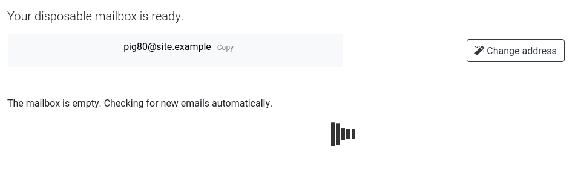

# Disposable-mailbox Docker
*A self hosted yopmail like server running in a docker*

## What is Yopmail ?

Yopmail is a **light webmail client** designed to **receive mails only** (no sending !) using **on the fly email addresses**. Its goal is to be able to use **infinite email addresses** without any account or password. It can be useful for online one time subscription, creating multiple accounts, trying email reception..

## Why Disposable-mailbox Docker ?
Yopmail like services are public, but for **privacy** you can run your own. You just need to install a mail receiver, a mail transfer agent and an HTTP server; then configure them all. This may be a bit long and complicated for unexperienced system administrators.

The easiest thing to solve the problem is to have **everything installed and configured** in a regular Docker. That's what is Disposable-mailbox Docker.

## Project architecture
This project uses [**Docker**](https://www.docker.com/) and [**docker-compose**](https://docs.docker.com/compose/).

The docker-compose runs **2 docker containers**: one for the email agents and one for the web server.

The email agents in use for this project are [**Dovecot**](https://www.dovecot.org/) and [**Postfix**](http://www.postfix.org/). Those services are well known and well documented. Postfix receives the emails and Dovecot allows the web server to retrieve them through **IMAP** protocol.

The web server is a simple [**Apache2**](https://httpd.apache.org/) running [**synox/disposable-mailbox**](https://github.com/synox/disposable-mailbox) open source project.

The web server uses both HTTP and HTTPS, but redirects HTTP to HTTPS. The certificate is auto-generated using [**Let's Encrypt**](https://letsencrypt.org/).

## Installation
1. Clone this repo
2. Edit the `.env` file. Change the `FQDN` value by your domain and the `EMAIL` value by your email address. If your service is accessible through the Internet, you can change the value of `LETSENCRYPT` to `yes` to get a recognized HTTPS certificate.
3. Save the file
4. Run `docker-compose up` and let docker build the project.
5. Open your browser on the localhost/chosen domain port `80` or `443` and you should see the landing page.
6. Run some tests using your favorite mail client to send mails to your Disposable-mailbox Docker addresses.

**Optional:**
- Edit the `web/disposable-mailbox.conf` file to add your IPs authorized to access the application in the `Allow from` lines and uncomment it. All the IPs out of the `Allow from` won't be able to access the web service (but can send emails to the mail server).

## Troubleshoot
If you encounter troubles, here are ways to debug:

**Get logs from syslog:**
- run interactively a container using `docker exec -it <container id> /bin/bash`
- install rsyslog `apt-get update && apt-get install rsyslog`
- run and get logs `/etc/init.d/rsyslog start && tail -f /var/log/syslog`

**List the mails received:**
- run interactively a container using `docker exec -it <container id> /bin/bash`
- go to `/var/mail/vmail`
- list the content `cur` : `ls -l cur`

**Connect a web client:**
- edit the `docker-compose.yml` to remove the "#" from the `rainloop` part
- run the docker-compose
- open your browser on `localhost:8888`
- connect using `vmail@<yourdomain>` and the password defined in the `web/www/disposable-mailbox/config.php`

## Credits
- Docker: [https://www.docker.com/](https://www.docker.com/)
- Docker-compose: [https://docs.docker.com/compose/](https://docs.docker.com/compose/)
- Dovecot: [https://www.dovecot.org/](https://www.dovecot.org/)
- Postfix: [http://www.postfix.org/](http://www.postfix.org/)
- Apache: [https://httpd.apache.org/](https://httpd.apache.org/)
- Synox/Disposable-mailbox: [https://github.com/synox/disposable-mailbox](https://github.com/synox/disposable-mailbox)
- Let's Encrypt: [https://letsencrypt.org/](https://letsencrypt.org/)
- OpenSSL: [https://www.openssl.org/](https://www.openssl.org/)
